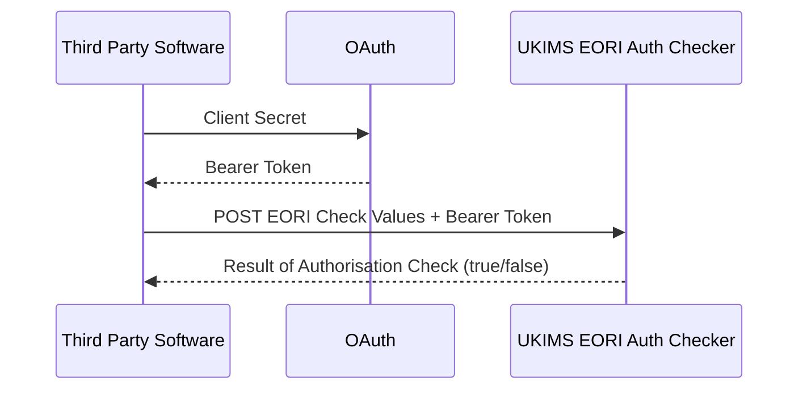

Version 1.0 issued July 15th 2024

# UK Internal Market Scheme (UKIMS) Authorisation Checker API Service Guide
This document introduces Fast Parcel Operators (FPOs), software developers and other third party software users to the UK Internal Market Scheme UKIMS Authorisation Checker API. Learn here about the processes involved in passing EORI numbers to check UKIMS validity.

**Note:** During this document's life-time some of the existing features of the API might be enhanced. You should periodically review the UKIMS Authorisation Checker Service Guide [Changelog](https://github.com/hmrc/ukim-auth-checker-api-service-guide/wiki/UK-Internal-Market-Scheme-(UKIMS)-Authorisation-Checker-API-Service-Guide-Changelog).

## API Overview 

This API allows Fast Parcel Operators (FPOs) software developers and third party software users to check if the holders of provided EORI Numbers have a valid UKIMS authorisation.
The aim is to avoid possible rejections of goods moving through from GB-NI, which could physically stop the B2B parcels.
    
The API is based on REST principles with a single POST method endpoint that returns data in JSON format. It uses standard HTTP error response codes. Use the API to request the UKIMS Authorisation Status of between 1 to 3000 EORIs passed as an array. 
    
**Note:** The API endpoint relates only to Great Britain and Northern Ireland.


### What is an EORI?
The acronym EORI stands for Economic Operators Registration and Identification. It is a unique identification number used by customs authorities throughout the European Union (EU)-12. This system, instituted on July 1, 2009, replaced the older Trader’s Unique Reference Number (TURN). The EORI number plays a critical role in facilitating the import and export of goods both within the EU and with countries outside of it. Whether you’re a business or an individual, understanding the EORI system is crucial if you plan to engage in international trade. For those based in the UK, HM Revenue and Customs (HMRC) are responsible for allocating these numbers.

Below is a breakdown of the EORI number format for UK VAT-registered businesses. A typical EORI originating in the GB or Northern Ireland is as follows:

```code
GB205672212000  # EORI originating in the GB i.e Wales, England or Scotland.
XI347643313000  # EORI originating in Northern Ireland.
```

- GB or XI: Indicates that the business is based either in mainland Britain (GB) or Northern Ireland (XI).
- 205672212: Represents the business’s VAT Registration Number.
- 000: These three zeros are always added to the end of an EORI number.
- Total number of characters permitted for the EORI (including the prefix GB or XI) is 14.

In summary, having an EORI number is essential for anyone involved in international trade, as it allows customs authorities to monitor and track shipments effectively.

## Process Flow



## API Status

This version of the UKIMS Authorisation Checker API:

- supports **only** the UKIMS Authorisation Checker API v1.0
- is currently **not** ready for testing
- will **not** be ready for use in production until the service goes live

## User Journeys
These journeys show practical preparation and use of the API:

- [Developer setup](#developer-setup)
- [Making API Requests](#making-api-requests)
- [Validating a collection of EORI numbers](#validating-a-collection-of-eori-numbers)

## Use the API to:

- Request the UKIMS Authorisation Status of 1-3000 EORIs passed as an array.
- Run tests in the HMRC sandbox environment.

## Developer Setup

To develop using the UKIMS Authorisation Checker API, you must:

- be familiar with HTTP, RESTful services, JSON and OAuth
- be registered as a developer on the [HMRC Developer Hub](https://developer.service.hmrc.gov.uk/api-documentation/docs/api)

You can view all the applications you have currently registered on the Developer Hub Applications page, where you can also administer API subscriptions and application credentials.

## Getting started

### Making API requests

Before sending any requests to the UKIMS Authorisation Checker API, make sure that you are addressing the following points
in your software:

- the correct URL for the environment and API version number
- the correct header contents and payload information

For details, see the [UKIMS Authorisation Checker API v1.0 Reference Guide](/api-documentation/docs/api/service/ukim-auth-checker-api/1.0/oas/page).

The base URLs of the sandbox and production environments are as follows:

```code
Sandbox	https://test-api.service.hmrc.gov.uk/customs/uk-internal-market/authorisations

Production https://api.service.hmrc.gov.uk/customs/uk-internal-market/authorisations
```


### Validating a collection of EORI numbers

Link to POST method in the [UKIMS Authorisation Checker API v1.0 Reference Guide](/api-documentation/docs/api/service/ukim-auth-checker-api/1.0/oas/page).

### Example of a POST request

```curl
curl --location POST 'https://test-api.service.hmrc.gov.uk/customs/uk-internal-market/authorisations
{
"date": "2024-02-31",
"eoris": [
"GB123123123000"
]
}
```

Example of a successful response:

```code
{
  "date": "2024-02-31",
  "eoris": [
    {
      "eori": "GB123123123000",
      "authorised": true
    }
  ]
}
```

An example of an unsuccessful response, in this case a 401 error. This error response is typically generated when authentication information is not provided, in this example by omitting a bearer token:

POST Request payload:

```code
headers: {
    "Content-Type" : "application/json",
    "Authorisation": `*empty*`
  }
```
Response: 

```code
{
  "code": "MISSING_CREDENTIALS",
  "message": "Authentication information is not provided"
}
```

## Error Responses

A detailed description of the error responses for this API can be found in the [UKIMS Authorisation Checker API v1.0 Reference Guide](/api-documentation/docs/api/service/ukim-auth-checker-api/1.0/oas/page).
 
## API rate limiting
Each software house should register a single application with HMRC. This application will be used to identify the software house during the OAuth 2.0 grant flow and will also be used in subsequent per user API calls. We limit the number of requests that each application can make. This protects our backend service against excessive load and encourages real-time API calls over batch processing.

We set limits based on anticipated loads and peaks. Our standard limit is 3 requests per second per application. If you believe that your application will sustain traffic load above this value, contact the SDS Team at email [SDSTeam@hmrc.gov.uk](mailto:SDSTeam@hmrc.gov.uk)

## Changelog

You can find the changelog for this document in the [UKIMS Authorisation Checker API v1.0 Service Guide](https://github.com/hmrc/ukim-auth-checker-api-service-guide/wiki/UK-Internal-Market-Scheme-(UKIMS)-Authorisation-Checker-API-Service-Guide-Changelog) GitHub wiki.

